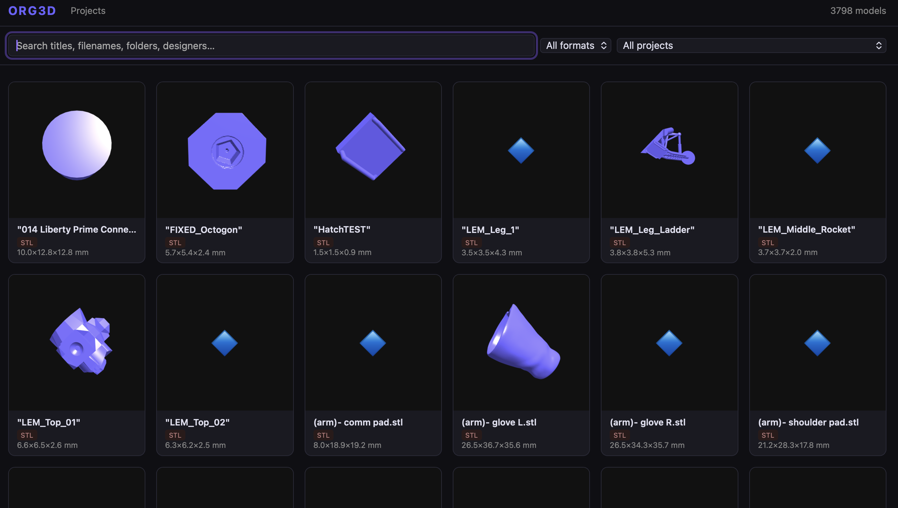
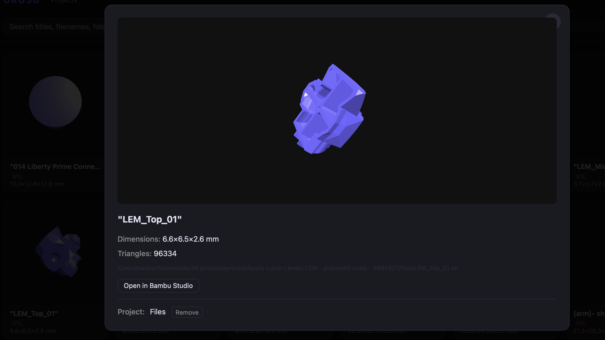

# org3d

A local gallery and organiser for 3D print files. Scans a directory of 3MF and STL files, extracts metadata, and serves a searchable web UI with 3D previews.





## Features

- **Browses 3MF and STL files** — extracts title, designer, description, dimensions, triangle count, and embedded thumbnails from 3MF files
- **Full-text search** — searches titles, designers, descriptions, filenames, folders, and project names
- **3D preview** — interactive WebGL viewer with mouse rotation and zoom; auto-captures thumbnails on first view
- **Projects** — group related models together; type-ahead autocomplete on assignment
- **Open in Bambu Studio** — one click opens the file directly in Bambu Studio from disk
- **Rename** — renames files to `Designer - Title.3mf` based on embedded metadata (dry-run by default)
- **Autogroup** — automatically creates projects from shared folder names
- **Extract** — unpacks ZIP archives and re-scans in one step

## Install

```
cargo build --release
```

The binary is at `target/release/org3d`. No other dependencies required — SQLite is bundled.

## Usage

### Quick start

```
org3d run ~/Downloads/3d-prints
```

Scans on first run, then serves the gallery at [http://localhost:3000](http://localhost:3000). On subsequent runs it skips the scan unless `--rescan` is passed.

### Commands

```
org3d scan <path>              Index all 3MF/STL files under <path>
org3d serve <path>             Start the gallery (no scan)
org3d run <path>               Scan if empty, then serve
org3d rename <path>            Preview metadata-based renames (--apply to execute)
org3d extract <path>           Unpack ZIPs (--scan to re-index immediately)
org3d autogroup                Create projects from folder names
```

### Options

```
--db <path>        SQLite database file  [default: org3d.db]
--thumbs <path>    Thumbnail directory   [default: thumbs]
--port <port>      Port for serve/run    [default: 3000]
```

### Examples

```bash
# First time setup
org3d run ~/Downloads/3d-prints --port 8080

# Force a rescan after adding new files
org3d run ~/Downloads/3d-prints --rescan

# Preview what rename would do
org3d rename ~/Downloads/3d-prints

# Rename files to match their embedded metadata
org3d rename ~/Downloads/3d-prints --apply

# Unpack any .zip files, then scan
org3d extract ~/Downloads/3d-prints --scan

# Group models into projects based on their folder structure
org3d autogroup
```

## Resetting the database

```bash
rm org3d.db org3d.db-shm org3d.db-wal
org3d run ~/Downloads/3d-prints
```

## Supported formats

| Format | Metadata | Thumbnail | 3D preview |
|--------|----------|-----------|------------|
| 3MF    | ✓        | ✓         | ✓          |
| STL    | —        | captured on first view | ✓ |

3MF metadata extraction handles both standard single-file 3MFs and Bambu Studio's multi-file layout (`3D/Objects/*.model`). Object transforms from the `<build>` section are applied so multi-object files appear correctly positioned in the viewer.

## Tech

- **Rust** — Axum, rusqlite (SQLite + FTS5), roxmltree, clap, tokio
- **Frontend** — HTMX, Three.js, vanilla JS; no build step
- **Templates** — minijinja (Jinja2-compatible, compiled into the binary)
